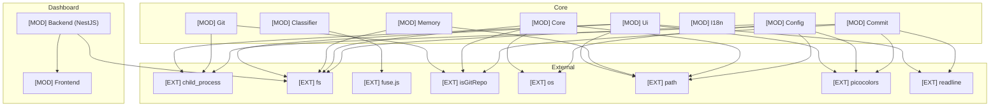

# Architecture Diagram

```mermaid
flowchart TD
  subgraph Core ["Core"]
      src_classifier_js["[MOD] Classifier"]
      src_commit_js["[MOD] Commit"]
      src_config_js["[MOD] Config"]
      src_core_js["[MOD] Core"]
      src_git_js["[MOD] Git"]
      src_i18n_js["[MOD] I18n"]
      src_memory_js["[MOD] Memory"]
      src_ui_js["[MOD] Ui"]
  end
  subgraph External ["External"]
      child_process["[EXT] child_process"]
      fs["[EXT] fs"]
      fuse_js["[EXT] fuse.js"]
      isGitRepo["[EXT] isGitRepo"]
      os["[EXT] os"]
      path["[EXT] path"]
      picocolors["[EXT] picocolors"]
      readline["[EXT] readline"]
  end
  subgraph Dashboard ["Dashboard"]
      dash_backend["[MOD] Backend (NestJS)"]
      dash_frontend["[MOD] Frontend"]
  end
  src_classifier_js --> fuse_js
  src_commit_js --> child_process
  src_commit_js --> isGitRepo
  src_commit_js --> picocolors
  src_commit_js --> readline
  src_config_js --> fs
  src_config_js --> os
  src_config_js --> path
  src_config_js --> picocolors
  src_core_js --> fs
  src_core_js --> isGitRepo
  src_core_js --> os
  src_core_js --> path
  src_git_js --> child_process
  src_git_js --> isGitRepo
  src_memory_js --> fs
  src_memory_js --> path
  src_ui_js --> child_process
  src_ui_js --> fs
  src_ui_js --> path
  src_ui_js --> picocolors
  src_ui_js --> readline
  dash_backend --> fs
  dash_backend --> dash_frontend

```